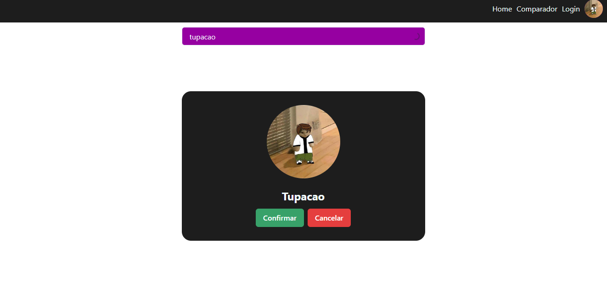
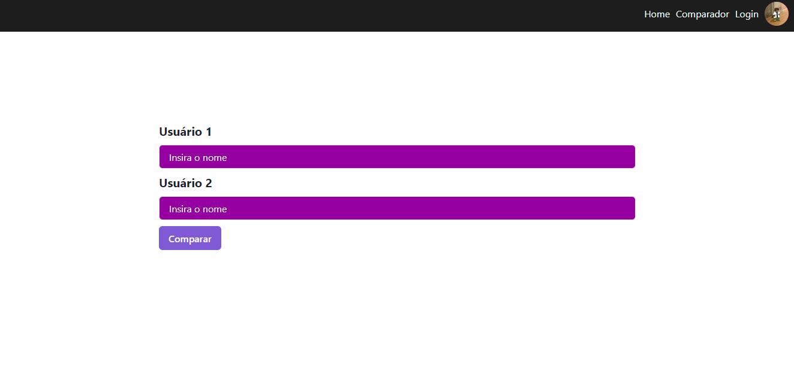
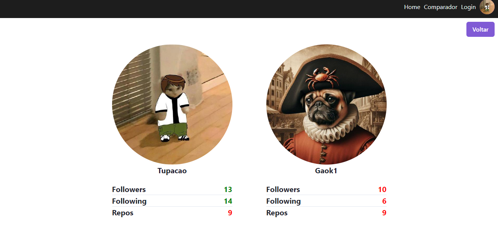

# Criação de uma pequena aplicação com a api de usuários do GitHub

## Dependencias

Para instalar as dependências, execute o seguinte comando:
```sh
    npm install
    npm install axios
    npm install @chakra-ui/react @emotion/react @emotion/styled framer-motion
    npm install @fortawesome/fontawesome-svg-core
    npm install @fortawesome/free-solid-svg-icons
    npm install @fortawesome/free-regular-svg-icons
    npm install @fortawesome/free-brands-svg-icons
```
Crie também na pasta raiz um arquivo
> .env com a seguinte váriavel
> VITE_GITHUB_TOKEN = {Seu token do github}(https://github.com/settings/tokens)


## Paginação

A aplicação apresenta sua páginação dívidia em 4 partes, sendo essas a "Home", "Data", "Login" e "Compare"


```js
const router = createBrowserRouter([
  {
    path: "/",
    element: <Home/>,
    errorElement: <ErrorPage/>
  },
  {
    path: "/login",
    element: <Login/>,
  },
  {
    path: "/compare",
    element: <Compare/>,
  },
  {
    path: "/data/:name",
    element: <Data/>,
  }
])
```

## Home

Página principal do site que o usuário pode pesquisar um nome e verificar se existe na API do GitHUb


```js
useEffect(() => {
        axios({
            method: "get",
            url: "https://api.github.com/users",
            headers: {
                Authorization: `Bearer ${GITHUB_TOKEN}`
            }
        }).then((response) => {
            setUser(response.data)
        });
    }, [])

    const search = () => {
        axios({
            method: "get",
            url: `https://api.github.com/search/users?q=${name}`,
            headers: {
                Authorization: `Bearer ${GITHUB_TOKEN}`
            }
        }).then((response) => {
            setUser(response.data.items)
            setBefore(0)
            setNext(5)
        })
    }
```

## Data

Dados do usuário são mostrados na tela para visualização, bem como os repositórios públicos daquele usuário com o link que redireciona para os mesmos.


```js
useEffect(() => {
        const getUser = axios.get(`https://api.github.com/users/${name}`, {
            headers: { Authorization: `Bearer ${GITHUB_TOKEN}` }
        })

        const getRepos = axios.get(`https://api.github.com/users/${name}/repos`, {
            headers: { Authorization: `Bearer ${GITHUB_TOKEN}` }
        })

        const getFollowers = axios.get(`https://api.github.com/users/${name}/followers`, {
            headers: { Authorization: `Bearer ${GITHUB_TOKEN}` }
        });

        const getFollowings = axios.get(`https://api.github.com/users/${name}/following`, {
            headers: { Authorization: `Bearer ${GITHUB_TOKEN}` }
        });

        axios.all([getUser, getRepos, getFollowers, getFollowings])
            .then(axios.spread((userResponse, reposResponse, followersResponse, followingsResponse) => {
                setUser(userResponse.data)
                setRepos(reposResponse.data)
                setFollowers(followersResponse.data.length);
                setFollowings(followingsResponse.data.length);
            }))
    }, [])

```
> Utilização de Spreead para multiplas requisições simultâneas 

## Login

Página de login com o objetivo de mudar o ícone do usuário no canto superior direito



```js
axios({
            method: "get",
            url: `https://api.github.com/users/${name}`,
            headers: {
                Authorization: `Bearer ${GITHUB_TOKEN}`
            }
        }).then((response) => {
            setUser(response.data)
        });
```

## Compare

Compara dois usuário em relação ao seu número de seguidores, repositórios e pessoas que ele segue




```js
 const searchUser = (name: string, setUser: any) => {
        axios({
            method: "get",
            url: `https://api.github.com/users/${name}`,
            headers: {
                Authorization: `Bearer ${GITHUB_TOKEN}`
            }
        }).then((response) => {
            setUser(response.data)
            console.log(response.data)
        });
    }

```