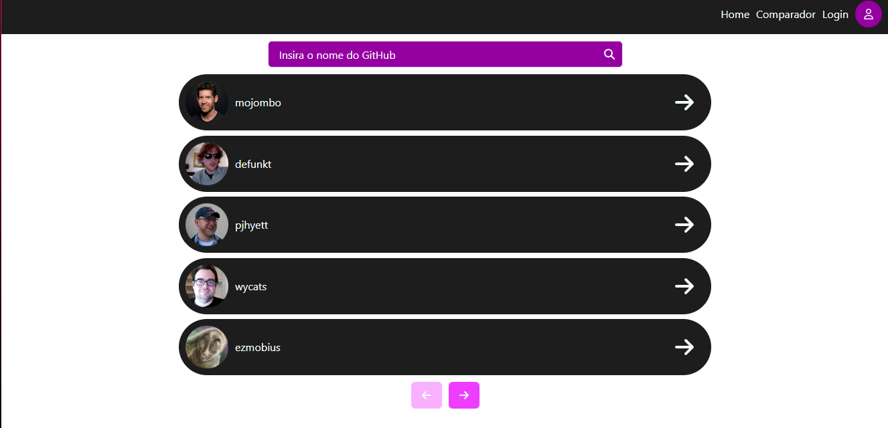
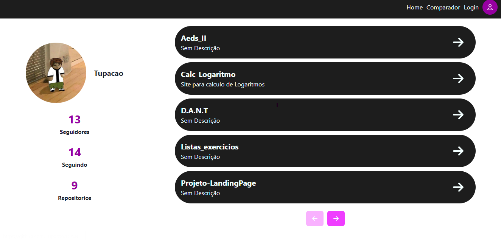

# Criação de uma pequena aplicação com a api de usuários do GitHub


## Paginação

A aplicação apresenta sua páginação dívidia em 4 partes, sendo essas a "Home", "Data", "Login" e "Compare"


```js
const router = createBrowserRouter([
  {
    path: "/",
    element: <Home/>,
    errorElement: <ErrorPage/>
  },
  {
    path: "/login",
    element: <Login/>,
  },
  {
    path: "/compare",
    element: <Compare/>,
  },
  {
    path: "/data/:name",
    element: <Data/>,
  }
])
```

## Home

> Página principal do site que o usuário pode pesquisar um nome e verificar se existe na API do GitHUb
> ```java
useEffect(() => {
        axios({
            method: "get",
            url: "https://api.github.com/users",
            headers: {
                Authorization: `Bearer ${GITHUB_TOKEN}`
            }
        }).then((response) => {
            setUser(response.data)
        });
    }, [])

    const search = () => {
        axios({
            method: "get",
            url: `https://api.github.com/search/users?q=${name}`,
            headers: {
                Authorization: `Bearer ${GITHUB_TOKEN}`
            }
        }).then((response) => {
            setUser(response.data.items)
            setBefore(0)
            setNext(5)
        })
    }
    ```

## Data

## Login

## Compare


- Replace `plugin:@typescript-eslint/recommended` to `plugin:@typescript-eslint/recommended-type-checked` or `plugin:@typescript-eslint/strict-type-checked`
- Optionally add `plugin:@typescript-eslint/stylistic-type-checked`
- Install [eslint-plugin-react](https://github.com/jsx-eslint/eslint-plugin-react) and add `plugin:react/recommended` & `plugin:react/jsx-runtime` to the `extends` list
